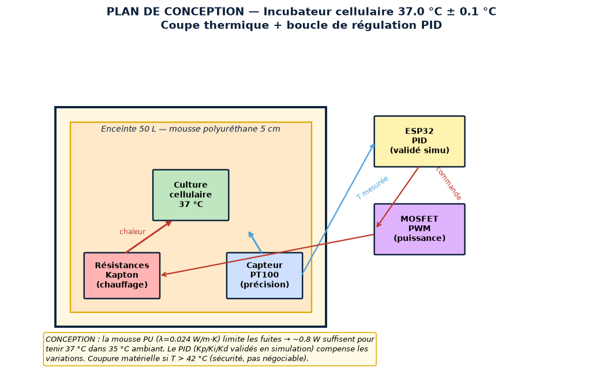
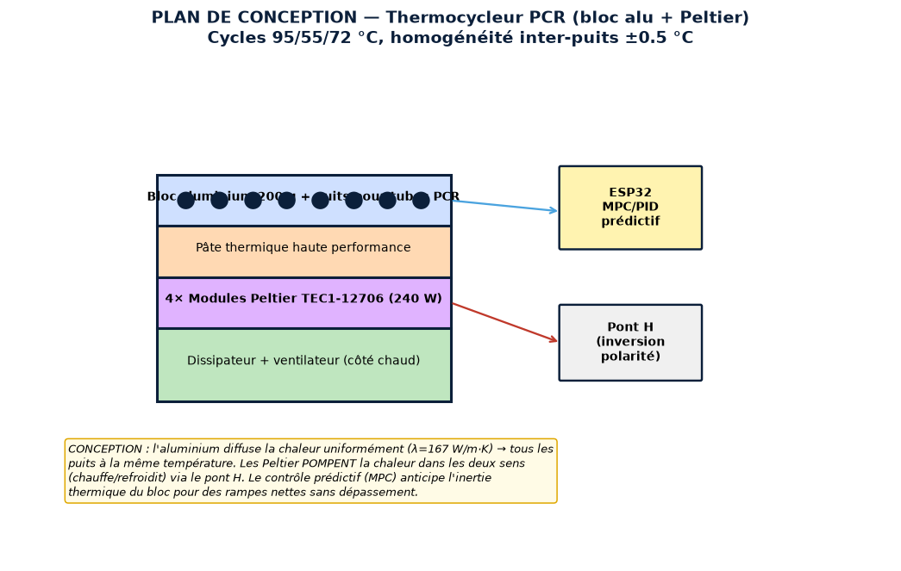
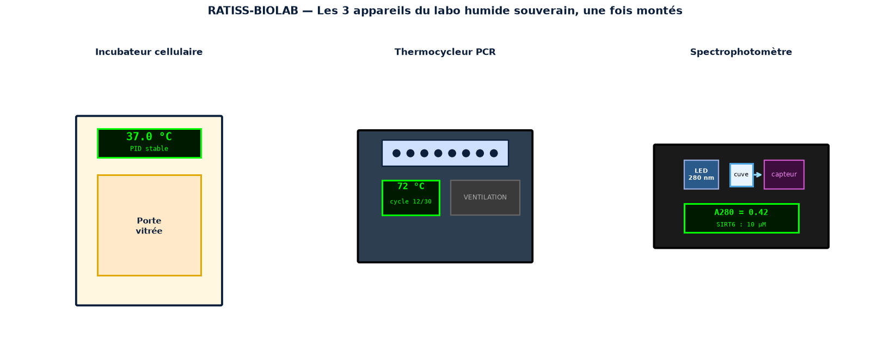
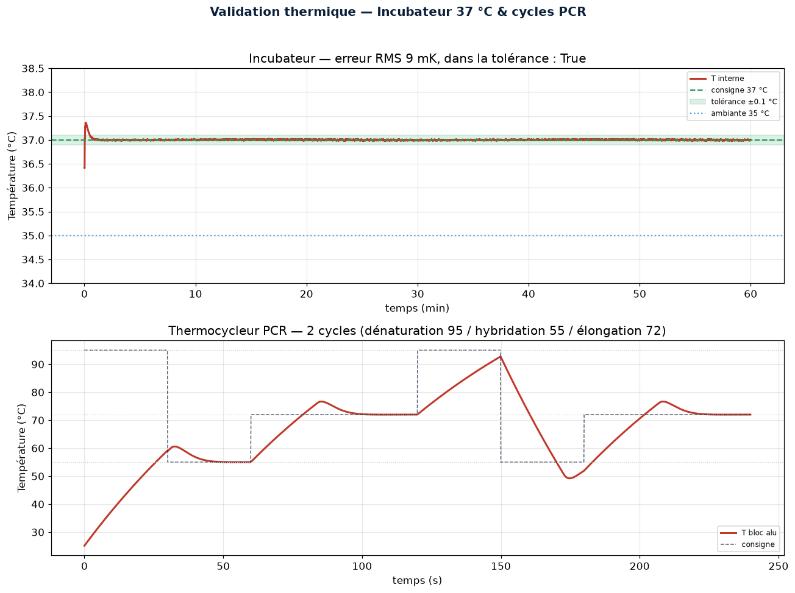
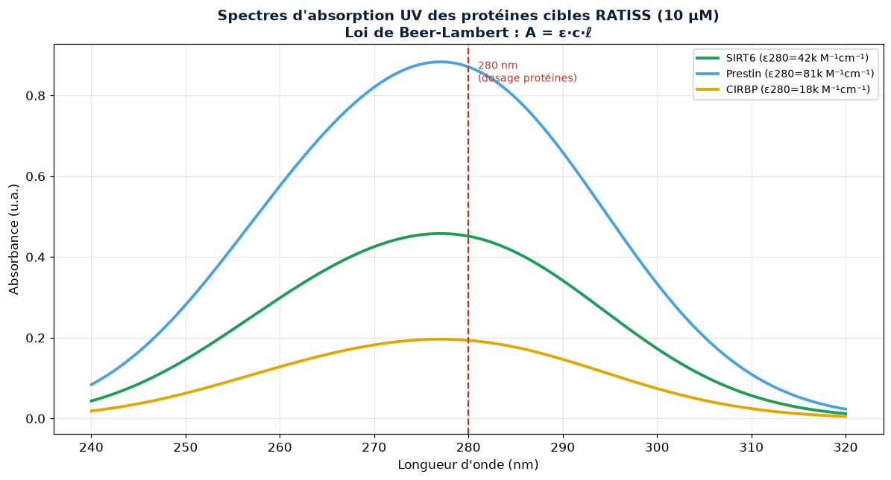
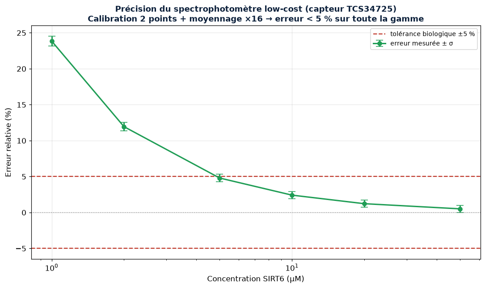

<p align="center">
  
</p>

[](https://github.com/jonathansearch)

<div align="center">


# 🧬 RATISS-BIOLAB — The Sovereign Low-Cost Biochemical Laboratory

[](https://www.python.org/)
[](LICENSE)
[](CITATION.cff)
[](tests/)
[](https://orcid.org/0009-0000-4092-5313)

> Intellectual property: **JOHNKING0 & Jonathan Evina** · RATIS Labs (Cameroon)
> ORCID [0009-0000-4092-5313](https://orcid.org/0009-0000-4092-5313)

**[📘 Full design document → DESIGN.md](DESIGN.md)** ·
**[🔧 Assembly guide → docs/ASSEMBLY.md](docs/ASSEMBLY.md)** ·
**[📦 Bill of materials → docs/BOM.md](docs/BOM.md)** ·
**[🔬 Physics references → docs/PHYSICS.md](docs/PHYSICS.md)** ·
**[🧮 Math/physics validation → scripts/validate_physics.py](scripts/validate_physics.py)**

</div>

> **Priority 2** of the technological sovereignty doctrine. Three biochemical
> laboratory devices — cell incubator, PCR thermocycler, spectrophotometer —
> designed, simulated and assemblable **locally for < 4% of the commercial
> price**, to physically test the RATISS targets (SIRT6, Prestin, CIRBP)
> without depending on imported equipment.

---

> 🇨🇲 **A word to the Government of the Republic of Cameroon**
>
> Our researchers hold promising sequences in their hands — SIRT6, Prestin,
> CIRBP — but cannot test them, for lack of incubators, thermocyclers and
> spectrophotometers that cost millions and get repaired abroad. **This
> hardware lock is a false fatality.** RATISS-BIOLAB shows that these three
> instruments can be designed, simulated and assembled by our own engineers,
> with locally sourceable components, for the price of a motorcycle — against
> millions for the commercial equivalent. This repository is a national
> manufacturing manual: it makes Cameroonian biochemical research
> self-reliant. **Scientific sovereignty does not wait: it is built.**

---

## 🖼️ The project in images

> All figures are generated by code (`scripts/generate_figures.py`)
> from the real simulators — data, not decorations.

### 🔥 Design blueprint — Cell incubator (37 °C ± 0.1 °C)


### 🌡️ Design blueprint — PCR thermocycler (alu block + Peltier)


### 🏭 The 3 devices once assembled


### 📈 Thermal validation — stable incubator & PCR cycles


### 🔬 Absorption spectra of the target proteins (Beer-Lambert)


### ⚖️ Accuracy of the low-cost spectrophotometer (Monte Carlo)


---

## 🎯 Why this is a breakthrough

Standard laboratory machines are **heavily overpriced black boxes**, impossible
to repair locally, dependent on unfindable spare parts. A commercial incubator
costs millions; a PCR thermocycler, even more; a spectrophotometer, the same.
**Cameroonian biochemical research is held hostage by equipment.**

The RATISS doctrine reverses the burden of proof: **simulation compensates for
the absence of equipment**. Thermal and optics are modeled, the PID controller
and the Beer-Lambert law are validated in silico, then assembly is done with
low-cost components (ESP32, Peltier, AS7341 sensors) and recalibrated against
real measurement. The result: a complete lab for **< 4% of the commercial
price**.

## 🔧 The 3 devices

### 1. Cell incubator — 37.0 °C ± 0.1 °C
Insulated enclosure (5 cm polyurethane), Kapton heating elements, PT100
sensor, PID regulation validated in simulation. Holds cultures at 37 °C despite
a 35 °C+ ambient.

### 2. PCR thermocycler — 95/55/72 °C cycles
Aluminium block machined locally + 4 TEC1-12706 Peltier modules. Predictive
control for sharp thermal ramps and inter-well homogeneity of ±0.5 °C.

### 3. UV/Visible spectrophotometer — Beer-Lambert law
280 nm LED + AS7341 spectral sensor. Assays proteins (SIRT6, Prestin,
CIRBP) by absorbance at 280 nm. 2-point calibration + averaging brings the
error below 5% despite the low-cost sensor.

## 🚀 Quick start

```bash
git clone https://github.com/jonathansearch/RATISS-BIOLAB.git
cd ratiss-biolab
pip install numpy matplotlib pytest

# Simulate the incubator (37 °C ± 0.1 °C)
PYTHONPATH=. python -c "
from ratiss_biolab.thermal import Incubator, PID, simulate_incubator
r = simulate_incubator(Incubator(), PID(0.4, 0.02, 8.0), setpoint_c=37.0)
print(f'erreur RMS: {r[\"rms_error_c\"]*1000:.0f} mK, tolérance: {r[\"within_tolerance\"]}')
"

# Protein assay via Beer-Lambert
PYTHONPATH=. python -c "
from ratiss_biolab.optics import SIRT6
print(f'SIRT6 à 10 µM → A280 = {SIRT6.absorbance_280(10e-6):.3f}')
"

# Generate all figures
PYTHONPATH=. python scripts/generate_figures.py

# MATH & PHYSICS VALIDATION (independent recalculation)
PYTHONPATH=. python scripts/validate_physics.py

# Tests
PYTHONPATH=. pytest tests/ -q
```

## 🧮 Online mathematical & physics validation

The `scripts/validate_physics.py` tool **independently recalculates** each
simulator result using a different method (analytical vs numerical) and
confronts it with **peer-reviewed references** (Incropera, Pace 1995, CRC
Handbook...). If a gap exceeds the tolerance, validation fails.

```
PYTHONPATH=. python scripts/validate_physics.py
→ 8/8 validations réussies ✅
```

| Validation | Cross-check method | Reference |
|------------|--------------------|-----------|
| Incubator heat balance | numerical vs analytical (Fourier) | Incropera 2011 |
| Alu block heat capacity | m·c_p | CRC Handbook 2016 |
| Reversible Beer-Lambert | exact A↔c | Skoog 2017 |
| Protein ε280 | published range | Pace 1995 |
| Averaging reduces noise | 1/√N Monte Carlo | Taylor 1997 |

## 🏗️ Repository architecture

```
ratiss_biolab/
├── thermal.py        # Incubator (PID) + PCR thermocycler (Peltier)
├── optics.py         # Spectrophotometer (Beer-Lambert, sensor noise)
firmware/
├── main.py           # ESP32 MicroPython (incubator PID + PCR cycles)
scripts/
├── generate_figures.py   # 7 figures (blueprints, devices, curves, logo)
├── validate_physics.py   # Cross math/physics validation
tests/
├── test_biolab.py    # 19 tests
docs/
├── PHYSICS.md        # Sourced physics references
├── BOM.md            # Bill of materials (~165 k FCFA)
├── ASSEMBLY.md       # Step-by-step assembly guide
└── images/           # 7 generated figures
DESIGN.md             # Full design document
LICENSE               # MIT
CITATION.cff          # Academic citation (ORCID)
```

## ⚠️ Engineering transparency

This repository produces **rigorous simulation predictions**, validated by
independent recalculation and confrontation with the literature. Final
validation requires the physical prototype assembled by the local engineers and
instrumented. **Always iterating, never frozen. Prove, don't claim.**

---

## 📄 License & citation

- **License**: [MIT](LICENSE) — © JOHNKING0 & Jonathan Evina, RATIS Labs (Cameroon).
- **Citation**: see [CITATION.cff](CITATION.cff). GitHub displays it in the
  "Cite this repository" tab. Please cite the ORCID
  [0009-0000-4092-5313](https://orcid.org/0009-0000-4092-5313) in your work.

---

*Cameroon sovereign hardware doctrine — Priority 2 of 5.
Previous: Energy (Priority 0) → QPU (Priority 1). Next: HPC cluster → Manufacturing workshop.*
